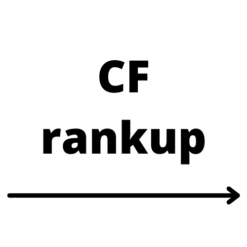

# codeforces-rankup 
# Website Link: [codeforces-rankup](https://rankup.kartikpapney.xyz/)

Hey everyone!

Ever feel stuck on Codeforces? Like you're just not getting any better?  You're not alone!  A lot of us hit a plateau.  But what if there was a way to break through that?

**Why are we stuck?**

One big reason is that we tend to solve problems at our current level, but to improve, we need to tackle harder ones.  Imagine you're at a 1400 rating. To get to 1500, you need to be solving problems rated 1400 and higher.  But not just any problems!  You need the *right* ones, the ones that will really help you learn and grow.

**Here's where codeforces-rankup comes in!**

This website lets you see problems that other, higher-rated Codeforces users have solved.  Think of it as learning from the best!

**How it works:**

1.  **Enter your Codeforces handle.**
2.  **Enter the handle of someone you want to learn from.** (Someone who's at the rating you're aiming for!)
3.  **codeforces-rankup will show you the problems they've solved.**

Now you have a list of hand-picked problems that will challenge you and help you level up! You can even add multiple people to the list for more problems. You can also filter by topics like dynamic programming, constructive algorithms, etc.

**Basically, it's like having a mentor show you the best problems to solve!**

I built this to help people like us improve on Codeforces.  I hope it helps you too!

**What I used to make it:**

* **React JS:** For the website itself.
* **Codeforces API:** To get the problem data.
