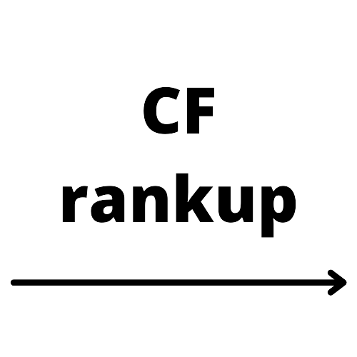

# codeforces-rankup 
# Website Link: [codeforces-rankup](https://master--infallible-albattani-89ab3f.netlify.app/)

Hi Everyone!!!
Are you struggling with Codeforces? Are you stuck at some rating? Do u wanna improve? If Yes, then I have a solution for you.

### When you struggle at CF?
One of the major reason of saturated rating on codeforces or any other coding platform is when you don't solve problems above your current level. Let's say I'm rated 1400 on codeforces then to improve my rating I should solve more problems with rating >= 1400. Now all these problems should be well hand picked. You should solve those problems whose difficulty level & topic has more positive impact on your current rating.

### Solution
At [codeforces-rankup](https://codeforces-rankup.web.app/) you can add problems to your list solved by some particular user. All you need his codeforces handle and you're ready to go.

Let's say you're rated 1500 at present and you're aiming for improving to 1600 in upcoming contests. Then you should add problems to your list which are solved by some coder who is rated>=1600 for a long time. You can continue this method for more than 1 profile if you want. For a better practice you can also select sub-topics(dp, constructive algorithms, bitmask). All of these functionality is provided at codeforces-rankup. I hope this solution will be helpful for you.

### Technologies Used
#### 1. React JS (Fronted Framework)
#### 2. Codeforces API
